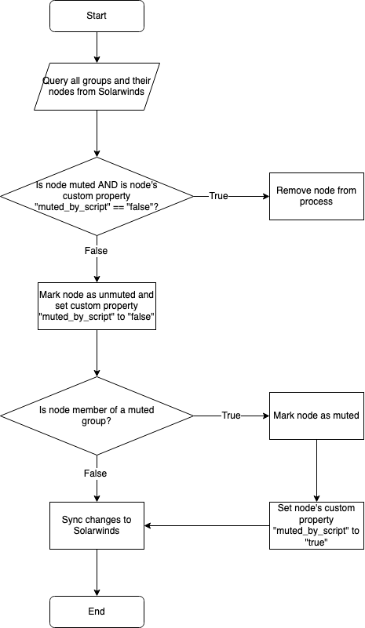

# [WiP] Group Muter Solarwinds
This is a script and APM template for muting Nodes under a group in Solarwinds.

<!--
## Download
You can download the template from the [releases page](/releases) under assets.
-->

## Process flow

## Resources
### API Documentation
[Solarwinds Github Wiki](https://github.com/solarwinds/OrionSDK/wiki/REST)

## License
[MIT](LICENSE)